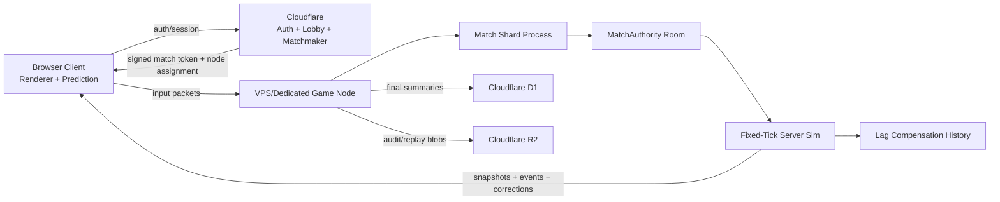

# Multiplayer Server-Authoritative Architecture Plan

## Purpose

This document captures the multiplayer architecture discussion for iBrawls and expands it into a practical planning reference. The target is a highly competitive multiplayer environment with strong anti-cheat boundaries, stable match simulation, predictable network behavior under ping variance and packet loss, and efficient infrastructure cost per active player.

The recommendation is a hybrid model:

- Cloudflare owns the control plane: static delivery, auth, sessions, lobby, matchmaking, signed match tokens, match summaries, replay/audit storage, and edge security.
- VPS or dedicated game nodes own the hot path: authoritative match simulation, WebSocket or future WebTransport gameplay traffic, lag compensation, snapshots, reconciliation, and per-match runtime state.

The goal is not only to move state to the server. The goal is to move the correct state to the server in a way that is performant, cheat-resistant, measurable, and cost-efficient.

## Current Multiplayer Baseline

Current multiplayer behavior is still mostly relay/client-authoritative:

- `server.ts` and `worker/src/index.ts` have an 8-player room model: host plus 7 guests.
- The Worker relay and local Node relay forward broad gameplay `sync` payloads.
- `src/network/protocol.ts` allows clients to send state fields such as position, velocity, HP, score, timers, and winner metadata.
- `src/components/grifball/activeFrameRuntime.ts` currently sends a full local player sync during active multiplayer frames.
- The repo already has an important headless simulation foundation under `src/sim`, including `stepSimulation` and `npm run sim:bench`.

That current shape is suitable for prototype multiplayer and casual relay play. It is not suitable for ranked competitive play because clients can still report too many outcome-bearing fields.

## Desired Competitive End State

The competitive end state should be:

```text
Client sends inputs
Server simulates match
Server validates outcomes
Server sends snapshots/events
Client predicts, interpolates, and reconciles
```

The server owns:

- Player position and velocity after validation.
- HP, damage, invulnerability, deaths, respawns, and cooldowns.
- Ball/objective state.
- Score, match timer, round phase, and winner.
- Spawn slots and spawn safety.
- Weapon state, attack windows, hit validation, and goal validation.
- Ranked match result and audit evidence.

The client owns:

- Local input collection.
- Local prediction for responsiveness.
- Rendering, animation, particles, camera, HUD, audio, and UI.
- Remote-player interpolation.
- Visual smoothing after server corrections.

The client can request actions. It should not declare outcomes.

## Recommended High-Level Architecture



### Cloudflare Responsibilities

Cloudflare should handle:

- Static app delivery.
- Account/session validation.
- One-active-session enforcement for signed-in users.
- Lobby presence and room discovery.
- Matchmaking and region selection.
- Signed match token issuance.
- Game-node health and capacity metadata.
- Match summary persistence in D1.
- Replay/audit blob storage in R2.
- WAF, DDoS shielding, bot defenses, and basic edge rate limiting.

Cloudflare should not be the live ranked simulation hot path unless we deliberately choose Cloudflare Containers for that purpose.

### Game Node Responsibilities

VPS or dedicated game nodes should handle:

- Authoritative match simulation.
- Input buffering and validation.
- Snapshot production.
- Lag compensation and bounded rewind.
- Client prediction reconciliation.
- Packet-loss and backpressure behavior.
- Ranked disconnect, timeout, and reconnect rules.
- Per-match audit event logs.
- Final match summary handoff to Cloudflare.

## Hosting Options Compared

### Option A: Cloudflare Free / Low-Cost Durable Objects

Cloudflare Workers and Durable Objects are useful for coordination and low-rate state. Durable Objects are available on Free and Paid plans, but Free has meaningful daily limits. Cloudflare documents Durable Object billing around requests, duration, WebSocket messages, and storage. Incoming WebSocket messages are factored at a 20:1 ratio for Durable Object request billing, and WebSockets accepted by a Durable Object can keep duration billing active while connected.

Source: [Cloudflare Workers pricing](https://developers.cloudflare.com/workers/platform/pricing/)

| Pros | Cons |
|---|---|
| Excellent for lobby, presence, auth-adjacent coordination, and small authoritative rules. | Not a good fit for full 30-60 Hz ranked match simulation. |
| Very low startup cost. | Free limits are easy to exceed with real-time active players. |
| Durable Objects provide simple per-room coordination. | Single-object coordination is not the same as a high-performance game server. |
| Global edge footprint helps control-plane latency. | Long-lived WebSocket gameplay traffic can become cost-sensitive. |

Best use:

- Lobby and matchmaking.
- Signed-room coordination.
- Presence.
- Small authoritative room metadata.
- Casual or staged migration authority.

Avoid using it for:

- Full authoritative movement simulation.
- Per-frame gameplay sync.
- Hot-path ranked combat validation at scale.

### Option B: Paid Cloudflare Workers + Durable Objects

Paid Workers and Durable Objects increase included usage and remove some Free-plan constraints. They are a strong control-plane choice and can support more authoritative room coordination.

Source: [Cloudflare Workers pricing](https://developers.cloudflare.com/workers/platform/pricing/)

| Pros | Cons |
|---|---|
| More headroom than Free while staying in one ecosystem. | Still not the cleanest model for a normal always-on game server. |
| Good for auth, matchmaking, lobbies, result persistence, and edge validation. | Compute is billed by requests/duration rather than fixed server capacity. |
| D1 and R2 integrate cleanly for match summaries and replay/audit storage. | Cost prediction is harder under constant real-time traffic. |
| Durable Objects are useful for strongly-consistent room/session entities. | WebSocket-heavy Durable Object usage requires careful hibernation and billing design. |

Best use:

- Production control plane.
- Paid-scale lobby and matchmaking.
- D1-backed account/session and match summary storage.
- Durable Object session or room coordination.

Avoid using it for:

- Cost-sensitive high-CCU ranked simulation if fixed VPS capacity is available.

### Option C: Cloudflare Containers

Cloudflare Containers can run containerized server processes and scale to zero. Cloudflare documents active billing by memory, vCPU, disk, and egress. Containers are available as part of Workers Paid and are routed through a Worker; each container has a Durable Object.

Source: [Cloudflare Containers pricing](https://developers.cloudflare.com/containers/pricing/)

| Pros | Cons |
|---|---|
| Cloudflare-only path for running a true game server process. | Still includes Worker and Durable Object billing around the container model. |
| Scale-to-zero can be efficient for bursty workloads. | Always-busy ranked servers may be less predictable than fixed VPS pricing. |
| Cleaner than trying to force full simulation into plain Workers or Durable Objects. | Container instance limits and placement behavior must be tested for game workloads. |
| Easier future portability if the authoritative server is packaged as a container. | Network egress is metered by region after included allotments. |

Best use:

- Future Cloudflare-only deployment option.
- Burst or special-mode match servers.
- Containerized authoritative server experiments.

Avoid relying on it before:

- Benchmarking steady 2,000 active player traffic.
- Confirming cost under sustained WebSocket or WebTransport-style usage.
- Confirming regional placement and cold-start behavior meet competitive requirements.

### Option D: VPS / Dedicated Game Nodes

VPS or dedicated servers provide the most direct control over game server performance and cost. DigitalOcean documents per-second Droplet billing and pooled outbound transfer with overage billing. Hetzner documents shared versus dedicated cloud resources, with dedicated resources having dedicated CPU resources and being appropriate for CPU-intensive workloads.

Sources:

- [DigitalOcean Droplet pricing](https://docs.digitalocean.com/products/droplets/details/pricing/)
- [Hetzner Cloud server overview](https://docs.hetzner.com/cloud/servers/overview/)

| Pros | Cons |
|---|---|
| Fixed monthly cost is easier to reason about for sustained active player load. | More operations work: patching, deployment, monitoring, firewalling, incident response. |
| Full control over Node, process model, sockets, profiling, and network behavior. | You own regional scaling and failover. |
| Dedicated CPU options give better tick stability than shared/burstable resources. | DDoS and abuse handling need Cloudflare edge support and provider support. |
| Easiest place to run custom authoritative game server code. | Requires disciplined deployment automation and observability. |

Best use:

- Ranked authoritative simulation.
- Stable high-CCU match hosting.
- Performance profiling and cost-per-player tuning.

Avoid:

- One giant single server.
- Shared CPU nodes for ranked tick-critical workloads.
- Treating provider bandwidth allowances as an afterthought.

## Recommended Hybrid Choice

Use Cloudflare plus VPS/dedicated game nodes.

Cloudflare should remain the control plane because it is excellent for edge auth, lobby UX, room discovery, D1/R2 storage, and protective edge services. VPS or dedicated nodes should run the authoritative match hot path because ranked gameplay needs fixed process control, predictable CPU, low serialization overhead, direct socket behavior, and simple cost modeling.

This gives the best balance:

- Competitive integrity: server owns match outcomes.
- Cost control: game nodes are fixed-capacity pools.
- Operational flexibility: scale nodes by region and demand.
- Cloudflare value: edge services stay useful without being overloaded by per-tick simulation.
- Future portability: package game nodes as containers so Cloudflare Containers remains an option later.

## Capacity Assumptions For 2,000 Active Players

Assumptions:

- 2,000 active players means 2,000 concurrent players in live matches.
- Current room cap is 8 players, so 2,000 active players is about 250 simultaneous matches.
- Server simulation is headless, not Three.js-rendered.
- Ranked server tick is 30 Hz.
- Snapshots are 20 Hz.
- Full keyframes are 1-2 Hz.
- Client input sampling can remain 60 Hz, but inputs can be bundled or quantized.
- No heavy AI brains are running in ranked match servers unless explicitly needed.

Recommended production target:

| Capacity Goal | Recommended Shape |
|---|---|
| Early serious load test | 1 node, 4-8 dedicated vCPU, 16 GB RAM |
| 500-1,000 active players | 2-3 nodes, 8 dedicated vCPU, 16-32 GB RAM each |
| 2,000 active players | 4 nodes, 8 dedicated vCPU, 32 GB RAM each |
| Safer ranked production | 4 active nodes plus 1 hot spare |

Aggregate target:

| Resource | Target |
|---|---|
| Dedicated vCPU | 32 minimum, 40+ with spare capacity |
| RAM | 64-128 GB total |
| Network | 4 Gbps aggregate practical headroom |
| Disk | 80-200 GB NVMe per node |
| CPU utilization | Keep ranked nodes near 60-70% sustained max |

Do not run 2,000 ranked players on one large server. The failure blast radius is too high, and one overloaded event loop can damage match quality for too many players.

## Competitive Netcode Model

The recommended model is server-authoritative simulation with client prediction, interpolation, reconciliation, bounded lag compensation, and ranked network quality gates.

It is not full fighting-game rollback for the entire match. Full rollback is a powerful idea, but an 8-player 3D objective game with multiple actors, ball state, hitboxes, and variable ping is a poor candidate for full-match rollback across all clients. The better approach is rollback-like correction locally on the client, while the server remains the sole authoritative timeline.

### Client Prediction

The local client should apply its own inputs immediately so controls feel responsive.

Client sends:

```ts
{
  type: "input",
  matchId: string,
  playerId: string,
  inputSeq: number,
  clientTick: number,
  sampledAt: number,
  moveX: number,
  moveZ: number,
  yaw: number,
  pitch: number,
  buttons: number
}
```

Server sends authoritative snapshots. The client compares the server-confirmed state to predicted state:

- Small error: smooth correction.
- Medium error: short blend.
- Large error: snap and clear prediction history.

Pros:

- Keeps controls responsive.
- Compatible with server authority.
- Works well for movement-heavy games.

Cons:

- Requires deterministic-enough movement behavior between client and server.
- Needs careful correction smoothing to avoid visual jitter.
- Bugs can appear as rubber-banding if the server and client movement logic diverge.

### Remote Player Interpolation

Remote players should render slightly behind the server timeline, using buffered snapshots.

Recommended interpolation delay:

- Casual: 100-150 ms.
- Ranked: 80-120 ms, tuned by region and jitter.

Pros:

- Smooths jitter.
- Handles packet delay variation.
- Avoids predicting every remote player.

Cons:

- Remote players are visually behind the true server state.
- Requires lag-compensated combat validation so aiming still feels fair.

### Bounded Lag Compensation

The server should keep a compact history buffer, usually 100-250 ms, for hit validation.

When a player attacks:

1. Server receives input with sequence and client timing.
2. Server estimates the intended server tick.
3. Server rewinds relevant hitboxes within a strict cap.
4. Server validates range, angle, line-of-sight, cooldown, invulnerability, and weapon state.
5. Server applies the outcome on the current authoritative timeline.

Pros:

- Makes combat fairer for moderate-ping players.
- Reduces "I hit them on my screen" frustration.
- Keeps the server authoritative.

Cons:

- Overly generous rewind rewards high ping.
- Requires accurate clock sync and sequence tracking.
- Needs weapon-by-weapon tuning.

Recommended ranked caps:

| Metric | Target |
|---|---|
| Preferred ping | Under 80 ms |
| Acceptable ranked ping | Usually under 120-150 ms |
| Jitter | Under 20-30 ms |
| Packet loss | Under 2-3% |
| Rewind cap | 100-180 ms by weapon/action |
| Snapshot interpolation | 80-120 ms |

### Packet Loss Strategy

With WebSockets, packet loss is masked by TCP but can create head-of-line blocking. That is acceptable for the first authoritative implementation but not the highest competitive ceiling.

Short-term WebSocket strategy:

- Input sequence numbers.
- Snapshot sequence numbers.
- Client ACKs.
- Send recent input redundancy with each input packet.
- Periodic full keyframes.
- Delta snapshots.
- Drop stale snapshots when the socket is backed up.
- Use `socket.bufferedAmount` to detect per-client backpressure.

Long-term transport option:

- Keep reliable ordered traffic for match events and lobby.
- Use unreliable/sequenced datagram-style traffic for inputs and snapshots if WebTransport or a similar transport becomes viable for the browser target.

Pros of staying WebSocket first:

- Easier implementation.
- Works everywhere.
- Fits current relay foundation.

Cons:

- Head-of-line blocking under packet loss.
- Harder to separate reliable events from high-rate snapshots.
- Less ideal for high-end competitive networking.

## Match Server Process Model

Recommended node layout:

```text
GameNode Supervisor
  MatchShard process 0
    MatchAuthority rooms
  MatchShard process 1
    MatchAuthority rooms
  MatchShard process 2
    MatchAuthority rooms
  MatchShard process 3
    MatchAuthority rooms
```

Each `MatchAuthority` owns its room completely:

- Fixed tick.
- Input buffer.
- Simulation state.
- Lag-compensation history.
- Snapshot building.
- Match event log.

No cross-shard match state should exist in the hot path. No database reads or writes should happen during active match ticks.

Pros:

- Fault isolation.
- Better CPU-core utilization.
- Easier per-shard profiling.
- Easier to cap ranked load.

Cons:

- Requires supervisor/restart logic.
- Requires assignment and drain behavior.
- Requires metrics per shard, not just per node.

## Protocol Rework

Replace one broad `sync` payload with explicit message categories:

| Message | Direction | Purpose |
|---|---|---|
| `input` | Client to server | Player input request |
| `snapshot` | Server to client | Authoritative state delta/keyframe |
| `event` | Server to client | Goal, hit, death, respawn, weapon event |
| `correction` | Server to client | Local player reconciliation hint |
| `ack` | Client to server | Last processed snapshot/keyframe |
| `ping` / `pong` | Both | RTT, jitter, clock offset |
| `loading_status` | Both/control | Match readiness, outside simulation hot path |

Important rule:

- The client may send intent.
- The server sends outcomes.

Fields that should become server-output only:

- Position.
- Velocity.
- HP.
- Score.
- Kills/deaths.
- Game time.
- Winner.
- Ball state.
- Hit outcomes.
- Respawn state.

## Resource Optimization Plan

The most cost-effective server is one that minimizes work per tick and bytes per player. Do not start by buying bigger servers. Start by making the authoritative loop small.

### Simulation Optimization

Use:

- Plain serializable state.
- Typed arrays or stable flat objects where hot.
- Preallocated buffers.
- Object pools for transient events.
- Fixed tick scheduling.
- Static map collision data precomputed at match start.
- Deterministic RNG state for replay/audit.

Avoid:

- `THREE.Vector3` in server simulation.
- Creating new objects per entity per tick.
- JSON serialization in the match loop.
- Closures/timers per player in hot code.
- Logging per tick.
- Database access during ticks.
- Renderer-derived animation state in authority logic.

Pros:

- Higher players per vCPU.
- Lower GC pressure.
- More stable p99 tick timing.

Cons:

- Less ergonomic than rich object-oriented gameplay code.
- Requires stricter boundaries between render and simulation.

### Tick Rate Optimization

Recommended baseline:

| System | Rate |
|---|---:|
| Client render | 60-144 FPS |
| Client input sampling | 60 Hz |
| Server authoritative sim | 30 Hz |
| Server snapshots | 20 Hz |
| Full keyframes | 1-2 Hz |
| Lobby presence | 1 Hz or event-only |
| Spectators | 5-10 Hz by default |

Pros:

- Reduces CPU and bandwidth while keeping gameplay responsive.
- Separates visual smoothness from authoritative simulation frequency.

Cons:

- Requires client prediction and interpolation to hide lower server rates.
- Certain mechanics may need local substeps.

### Network Optimization

Replace JSON gameplay packets with binary packets.

Input packet concept:

```text
u16 inputSeq
u16 clientTick
i8  moveX
i8  moveZ
u16 yaw
i16 pitch
u16 buttonsBitset
```

Snapshot optimization:

- Quantize positions to map bounds.
- Quantize yaw/pitch.
- Use entity IDs instead of strings.
- Use dirty-bit masks.
- Send deltas from ACKed baselines.
- Send full keyframes periodically.
- Coalesce stale snapshots.
- Apply per-client interest where practical.

Pros:

- Major bandwidth savings.
- Lower CPU from smaller serialization.
- Lower GC from reusable buffers.

Cons:

- Harder to debug than JSON.
- Requires versioned protocol tooling.
- Needs packet inspectors and replay decoders.

### Lag Compensation History Optimization

Store only what rewind validation needs:

```text
history[tick % size]:
  player positions
  yaw
  hitbox flags
  invulnerability flags
  ball position or carrier
```

Do not store full player objects, animation trees, render state, or full replay frames in the rewind buffer.

Pros:

- Very low memory cost.
- Keeps hit validation fast.

Cons:

- Requires discipline when adding new rewind-validated mechanics.
- Debug replay may need a separate event log.

### Storage Optimization

Hot match servers should persist only after the match or in low-rate batches:

- Match result summary to D1.
- Optional compact ranked audit log to R2.
- Optional replay blob to R2.
- Metrics batched to analytics.

Do not write every tick to Cloudflare storage or local disk.

Pros:

- Protects tick stability.
- Keeps Cloudflare costs predictable.
- Makes replay/audit storage scalable.

Cons:

- Requires crash handling for in-progress matches.
- Needs end-of-match retry queue.

## Anti-Cheat Architecture

The server should validate:

- Movement speed, acceleration, gravity, jump count, crouch state.
- Weapon cooldowns and committed attack windows.
- Hammer/sword hit range, angle, timing, and invulnerability.
- Ball pickup, carry, throw, drop, and goal scoring.
- Spawn slots and spawn protection.
- Loadout legality.
- Match timer, score, winner, and forfeits.
- Reconnect identity and signed match token.

Client-side anti-cheat is useful as a signal, not as authority.

Pros:

- Strong ranked integrity.
- Better dispute resolution.
- Limits the damage from modified clients.

Cons:

- More server CPU.
- Requires consistent server/client movement logic.
- Requires tooling to distinguish cheating from bad network conditions.

## Ranked Quality Gates

Ranked should not accept every network condition. Casual can be lenient. Ranked should protect competitive quality.

Recommended gates:

| Condition | Ranked Behavior |
|---|---|
| High ping before match | Warn, prefer region change, possibly block ranked queue |
| Ping spikes during match | Continue with bounded compensation |
| Sustained high ping | Mark degraded, possibly forfeit/disconnect depending rule set |
| Packet loss over threshold | Warn, degrade, or remove from ranked |
| Repeated reconnects | Limit abuse, preserve match state briefly |
| Severe backpressure | Stop queueing stale snapshots, send keyframe/correction |

Pros:

- Protects competitive feel.
- Gives fairer matches.
- Makes ranked disputes easier to judge.

Cons:

- Some players will be excluded from ranked under poor network conditions.
- Requires clear UI messaging and region options.

## Observability And Benchmarks

The core KPI should be:

```text
ranked-quality active players per dedicated vCPU
```

Track:

| Metric | Target |
|---|---:|
| p95 shard tick time | Under 50% of tick budget |
| p99 event loop delay | Under 20-30 ms |
| Sustained CPU | Under 60-70% |
| GC pause p99 | Under 10-20 ms |
| Reconciliation error | Small and stable |
| Snapshot bytes/player/sec | Tracked by mode |
| Dropped/coalesced snapshots | Low and intentional |
| Inputs late/missing | Tracked per player |
| Rewind validation latency | Bounded |
| Match result write failures | Near zero with retry |

Expand `npm run sim:bench` to support:

- 250 simultaneous rooms.
- 2,000 simulated clients.
- Configurable tick rates.
- Packet encode/decode cost.
- Snapshot delta/keyframe cost.
- Artificial ping, jitter, loss, and backpressure.
- Per-shard event loop metrics.

## Migration Plan

### Phase 1: Separate Protocol Categories

Add new protocol messages beside existing `sync`:

- `input`
- `snapshot`
- `event`
- `correction`
- `ack`

Pros:

- Backward-compatible migration.
- Lets old relay behavior continue while new server-authoritative path is built.

Cons:

- Temporarily more protocol complexity.
- Requires careful feature flags.

### Phase 2: Server Owns Non-Movement Outcomes

Move these first:

- Match timer.
- Score.
- Winner.
- Spawn slots.
- Deaths/respawns.
- Ball goals.
- Match start/readiness.

Pros:

- High anti-cheat gain.
- Lower implementation risk than full movement authority.

Cons:

- Movement can still diverge.
- Combat fairness remains limited until hit validation moves server-side.

### Phase 3: Input-Driven Movement Authority

Clients send inputs. Server simulates movement. Clients predict and reconcile.

Pros:

- Removes client authority over position.
- Enables real anti-speedhack and anti-teleport rules.

Cons:

- Requires client/server movement parity.
- Reconciliation bugs become visible quickly.

### Phase 4: Server-Side Combat Validation

Move hit validation to the server with bounded rewind.

Pros:

- Major ranked integrity milestone.
- Prevents client-declared hits and damage.

Cons:

- Needs careful tuning to avoid high-ping abuse.
- Requires hitbox history and weapon-specific rules.

### Phase 5: Binary Snapshots And Delta Compression

Replace JSON match packets with binary protocol for ranked.

Pros:

- Major resource savings.
- Increases players per server dollar.

Cons:

- More tooling required.
- Harder manual debugging.

### Phase 6: Sharded Game Node Pool

Deploy authoritative match shards behind Cloudflare matchmaking.

Pros:

- Production-ready scaling model.
- Regional capacity and failover become possible.

Cons:

- Requires deployment automation, node draining, health reporting, and incident handling.

### Phase 7: Ranked Hardening

Add:

- Ping/jitter/loss gates.
- Reconnect rules.
- Match audit logs.
- Replay evidence.
- Abuse detection.
- Operational dashboards.

Pros:

- Moves the system from functional to competitive.

Cons:

- Requires ongoing tuning and player-facing policy decisions.

## Decision Matrix

| Decision | Recommendation | Why |
|---|---|---|
| Full Cloudflare Free authority | No | Not enough hot-path headroom for ranked 2,000-player simulation. |
| Paid Workers + DO for full sim | Not primary | Better than Free, but still not ideal for fixed-cost always-on game simulation. |
| Cloudflare Containers for full sim | Future option | Viable Cloudflare-only path, but benchmark cost and placement first. |
| VPS/dedicated for match sim | Yes | Best performance, profiling, and cost control for ranked authority. |
| Cloudflare for control plane | Yes | Excellent fit for auth, lobby, matchmaking, storage, and protection. |
| Full fighting-game rollback | No for full match | Too complex for 8-player 3D objective gameplay. |
| Client prediction + server reconciliation | Yes | Strong responsiveness with server authority. |
| Bounded lag compensation | Yes | Best tradeoff for fair combat under moderate ping. |
| WebSocket first | Yes | Practical migration path. |
| WebTransport/datagrams later | Consider | Better long-term packet-loss behavior if browser/platform support fits. |
| JSON gameplay packets | No for ranked | Too expensive and too permissive. |
| Binary/delta snapshots | Yes | Essential for cost efficiency at scale. |

## Open Questions

Before implementation, decide:

- Ranked server tick: 30 Hz baseline or 60 Hz for select modes?
- Snapshot rate: 15 Hz, 20 Hz, or adaptive?
- Maximum ranked ping and jitter thresholds.
- Rewind cap by weapon and action.
- Whether ranked supports observers, and at what update rate.
- Reconnect grace period.
- Match forfeit rules for disconnects.
- Whether casual and ranked use the same authority model with different gates.
- First target region set.
- Initial provider for game nodes.
- Whether to build WebTransport later or stay WebSocket through launch.

## Practical Recommendation

Build the authoritative server as a portable Node/TypeScript game server first, using the existing `src/sim` work as the foundation. Deploy it on dedicated-vCPU VPS or dedicated servers, with Cloudflare as the control plane. Keep the server packaged so it can later run in Cloudflare Containers if the pricing and behavior prove favorable.

Initial target:

- 30 Hz server authoritative simulation.
- 20 Hz snapshots.
- 1-2 Hz keyframes.
- Client prediction and reconciliation.
- Remote interpolation.
- Server-owned score, timer, ball, spawns, HP, damage, deaths, and winner.
- Bounded hit rewind for combat.
- Binary protocol for ranked.
- Sharded game-node process model.
- Benchmark target of 100+ ranked-quality active players per dedicated vCPU.

This gives iBrawls the best balance of competitive integrity, cost efficiency, and migration practicality.

## Source Links

- [Cloudflare Workers pricing](https://developers.cloudflare.com/workers/platform/pricing/)
- [Cloudflare Containers pricing](https://developers.cloudflare.com/containers/pricing/)
- [DigitalOcean Droplet pricing](https://docs.digitalocean.com/products/droplets/details/pricing/)
- [Hetzner Cloud server overview](https://docs.hetzner.com/cloud/servers/overview/)
